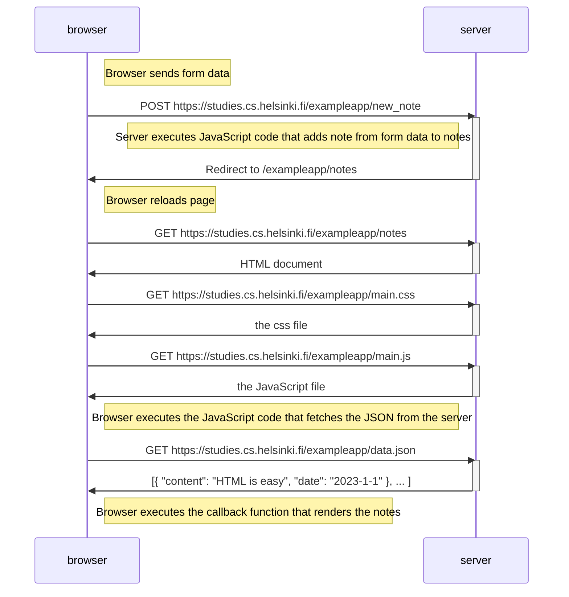
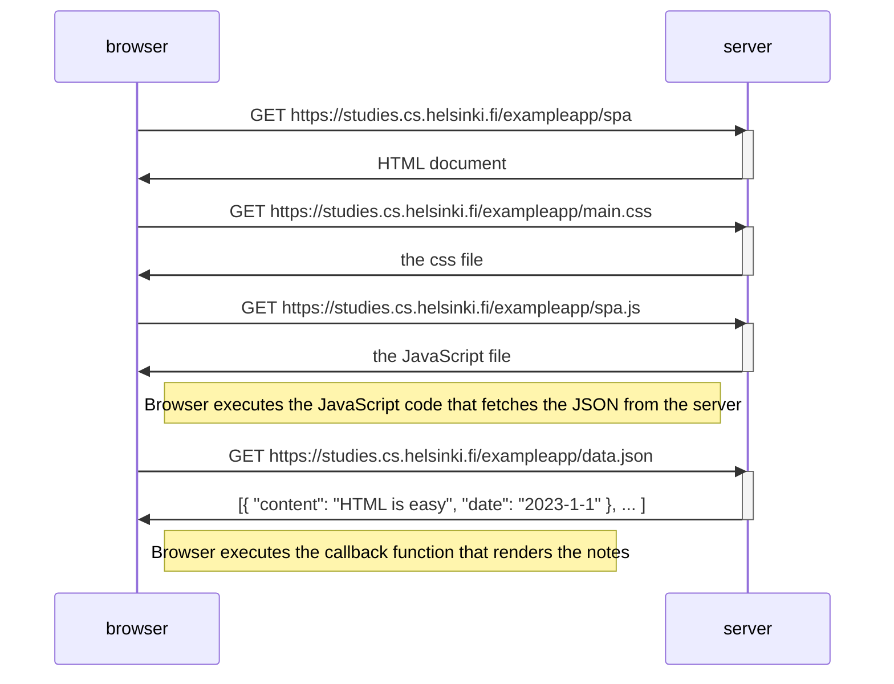
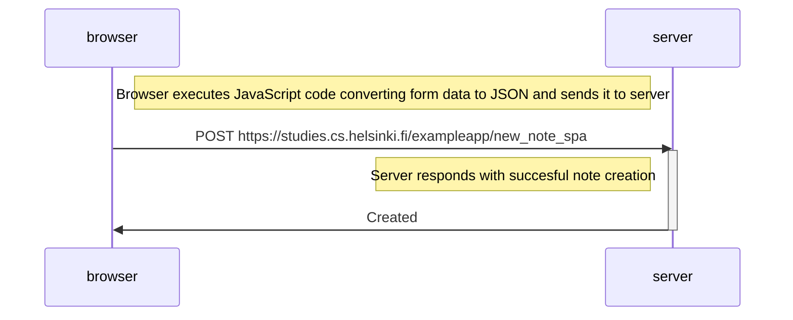

## 0.4: uusi muistiinpano

```mermaid
sequenceDiagram
    participant browser
    participant server

    note right of browser: Browser sends form data
    browser->>server: POST https://studies.cs.helsinki.fi/exampleapp/new_note
    activate server
    note left of server: Server executes JavaScript code that adds note from form data to notes
    server->>browser: Redirect to /exampleapp/notes
    deactivate server

    note right of browser: Browser reloads page

    browser->>server: GET https://studies.cs.helsinki.fi/exampleapp/notes
    activate server
    server->>browser: HTML document
    deactivate server
    
    browser->>server: GET https://studies.cs.helsinki.fi/exampleapp/main.css
    activate server
    server->>browser: the css file
    deactivate server
    
    browser->>server: GET https://studies.cs.helsinki.fi/exampleapp/main.js
    activate server
    server->>browser: the JavaScript file
    deactivate server
    
    note right of browser: Browser executes the JavaScript code that fetches the JSON from the server
    
    browser->>server: GET https://studies.cs.helsinki.fi/exampleapp/data.json
    activate server
    server->>browser: [{ "content": "HTML is easy", "date": "2023-1-1" }, ... ]
    deactivate server    

    note right of browser: Browser executes the callback function that renders the notes 
```

## 0.5: Single page app

```mermaid
sequenceDiagram
    participant browser
    participant server

    browser->>server: GET https://studies.cs.helsinki.fi/exampleapp/spa
    activate server
    server->>browser: HTML document
    deactivate server
    
    browser->>server: GET https://studies.cs.helsinki.fi/exampleapp/main.css
    activate server
    server->>browser: the css file
    deactivate server
    
    browser->>server: GET https://studies.cs.helsinki.fi/exampleapp/spa.js
    activate server
    server->>browser: the JavaScript file
    deactivate server
    
    note right of browser: Browser executes the JavaScript code that fetches the JSON from the server
    
    browser->>server: GET https://studies.cs.helsinki.fi/exampleapp/data.json
    activate server
    server->>browser: [{ "content": "HTML is easy", "date": "2023-1-1" }, ... ]
    deactivate server    

    note right of browser: Browser executes the callback function that renders the notes 
```

## 0.6: Uusi muistiinpano

```mermaid
sequenceDiagram
    participant browser
    participant server

    note right of browser: Browser executes JavaScript code converting form data to JSON and sends it to server
    browser->>server: POST https://studies.cs.helsinki.fi/exampleapp/new_note_spa
    activate server
    note left of server: Server responds with succesful note creation
    server->>browser: Created
    deactivate server
```